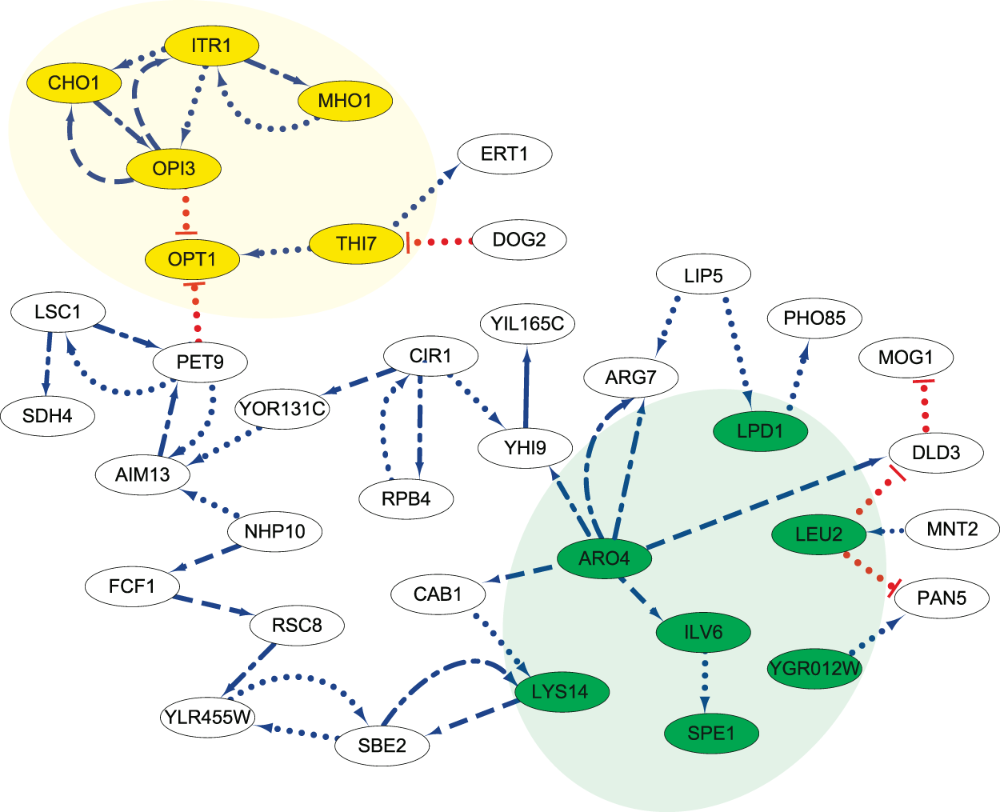

# Gene-Network-Simulation
Simulates gene expression change in response to cellular stressors

## Introduction

This program simulates changes in gene expression in response (in transcripts per million - TPM) to external cellular stressors. The program initializes a generic mammalian cell with several genes and their protein products:

- HSPA & HSPA5 -> heat shock protein family A
- SMARCA2 -> probable global transcription activator SNF2L2
- TP53 -> p35 protein
- VEGFA -> vascular endothelial growth factor A
- USP -> universal stress protein
- SCL2A1 -> glucose transporter protein (GLUT1)
- FOLH1 -> prostate-specific membrane antigen (PSMA)

Biologically, gene regulatory networks describe the web of interactions a gene may have with other genes, transcription factors, proteins, etc. In this program, gene regulatory networks are modeled as graph structures, where vertices are genes and edges are labeled as the positive/negative regulatory relationships.

Graph data structure:

Gene regulatory network:

## Usage
Download all src files and load in your current workspace. To use the console version, run the ConsoleExpressionAnalyzer.java file. 

Additional genes can be loaded into the program via two paths:

- Small scale: Manually enter the gene name and starting expression level (TPM)
- Batch: Enter .txt file with gene names and starting expression levels (TPM)
  Input file format: .txt file with gene name, expression level (TPM), and main stressor sensitivity, all separated by a space. See example genes.txt file.
  Name this file: genes.txt. If using an input .txt file, load this file in the same folder/workspace as the src.

The cell type can also be changed to muscle or epithelial cell types. The response of genes will vary when exposed to certain stressors based on the cell type. Currently, cells can be exposed to heat, pH change, mechanical, and hypoxic stress. The associated 'impact factor' with each stress serves to designate the stress severity. 

## Author & Contact
Emily Ekstrum, Creighton University

emilyekstrum@creighton.edu

## Citations
Graph image: https://www.geeksforgeeks.org/applications-of-graph-data-structure/

Gene network image: Chen, C., Zhang, D., Hazbun, T.R. et al. Inferring Gene Regulatory Networks from a Population of Yeast Segregants. Sci Rep 9, 1197 (2019). https://doi.org/10.1038/s41598-018-37667-4

** NOTE this program is not 100% biologically accurate. 
